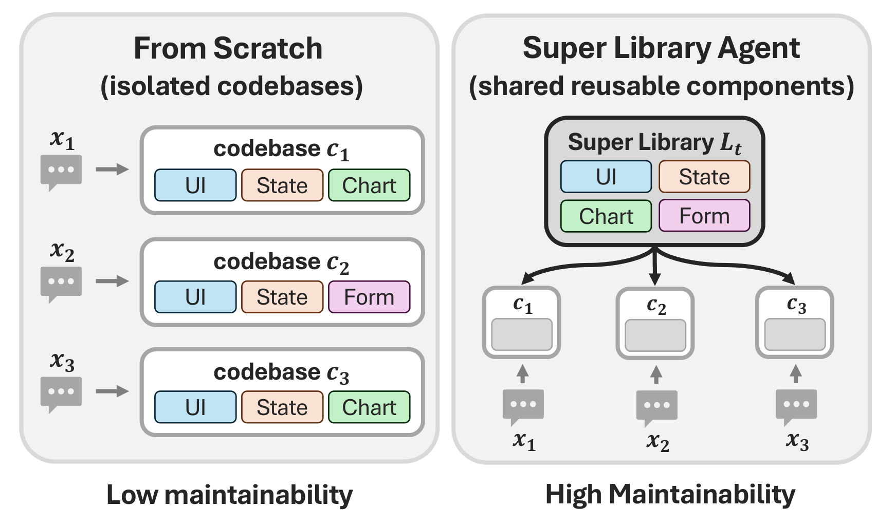
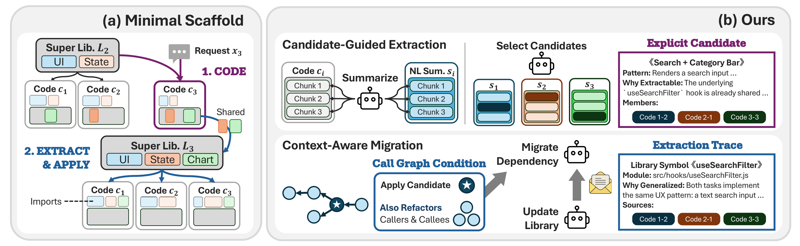

# SLA: Super-Library-Agent

Code for *Super Library Agent: Joint Generation and Maintenance of Multiple Applications Beyond the Single
Codebase*, EMNLP 2026 Findings. Project page: <https://sbigstar0310.github.io/super-library-agent/>

Teams rarely ship one application. They ship **portfolios**: separately deployable codebases that share domain
logic, interface patterns, and operational conventions. Hand each one to an LLM coding agent on its own and the
same header, the same form validation, the same storage logic is written again in every codebase, each a
slightly different way. One policy update then has to be applied by hand, once per codebase.



SLA works through a **suite**, a fixed group of related tasks, over several **rounds**. Each round writes a few
new applications, pulls what repeats across them into one shared library, and migrates every application
written so far to import from it. The goal is a portfolio that stays easier to maintain, at no cost to task
success. The paper measures that as the size of the patch a later policy update needs, alongside code volume,
duplication and description length.

Evaluated on two benchmarks: WebGen-Bench, which builds a React+Vite app from a one-line instruction, and
PaperBench, which writes Python that reproduces a research paper.

[Install](#install) · [Benchmark data](#benchmark-data) · [Candidate index](#candidate-index) ·
[Running](#running) · [Evaluating](#evaluating) · [Reproducing the paper](#reproducing-the-paper) ·
[Citation](#citation)



`MODE=baseline` is Zero-Shot, generation with no library. `MODE=sla_naive` gives one agent the whole portfolio
and asks it to extract shared code and update the callers. `MODE=sla_ours` splits that into four agents per
round: coding, local extract, global extract, apply. Agent classes are in `el-agent/src/mswe_agents/`; the
method is section 3 of the paper.

## Install

Docker and [uv](https://docs.astral.sh/uv/) are needed for everything. Node 18+ for the code metrics, git-lfs
for the PaperBench data, conda only for MDL.

```bash
cd el-agent && uv sync && cd ..     # Python 3.13 deps
npm install                         # eslint, jscpd, ast-grep, used by scb_quality.py

docker build -t sla-base        docker/sla-base         # WebGen agents and eval
docker build -t paperbench-base docker/paperbench-base  # PaperBench agents

cp .env.template .env
```

Zero-Shot needs only `OPENROUTER_API_KEY`. The library modes also summarize code chunks through an
OpenAI-compatible endpoint (`OPENAILIKE_*`), and the candidate index needs an embedding key of its own. Every
variable is commented in `.env.template`, with the fallback order the graders use.

## Benchmark data

```bash
cd data

git clone https://github.com/mnluzimu/WebGen-Bench.git WebGen-Bench
git -C WebGen-Bench checkout 1e69d30
git -C WebGen-Bench apply ../augments/patches/webgen-bench.diff

# PaperBench only, from here down
git clone https://github.com/openai/frontier-evals.git frontier-evals   # 2.2 GB, LFS
git -C frontier-evals checkout 51052ce
git -C frontier-evals apply ../augments/patches/frontier-evals.diff
(cd frontier-evals/project/paperbench && uv sync)

git clone https://github.com/SprocketLab/slop-code-bench.git slop-code-bench
git -C slop-code-bench checkout 03bf1f5
(cd slop-code-bench && uv sync)      # scb_quality.py re-execs into this venv

cd ..
```

Commits are pinned because suites address tasks by index. The patches are not optional: both harnesses ship
credentials as literal placeholder strings, and without them evaluation returns wrong numbers rather than
failing (`data/augments/patches/README.md`). Clusters and layout specs are already in `data/augments/`.

## Candidate index

`MODE=sla_ours` retrieves candidates through a cocoindex index. `uv sync` installs the `ccc` command but not its
daemon config at `~/.cocoindex_code/global_settings.yml`, which you write yourself:

```yaml
embedding:
  provider: litellm
  model: openai/text-embedding-3-small
envs:
  OPENAI_API_KEY: "<key for the embedding model above>"
```

Check it with `uv --project el-agent run ccc doctor`. Without it every task that needs candidates raises, but
the driver catches that per task, so the run finishes and still exits 0 with a portfolio built by a weaker
method. Read the log, or `grep "cocoindex sqlite missing"` after the fact. Zero-Shot does not use the index.

## Running

Zero-Shot needs one API key, no GPU, and about 10 minutes. SLA-Full takes about 1.5 hours for the same 8 apps.

```bash
TAG=demo MODE=baseline M=2 CLUSTER_ID=13 bash scripts/run/run_webgen_full.sh
TAG=demo MODE=sla_ours M=2 CLUSTER_ID=13 bash scripts/run/run_webgen_full.sh
TAG=demo MODE=sla_ours M=1 CLUSTER_ID=1  bash scripts/run/run_paperbench_full.sh
```

WebGen cluster 13 holds exactly 8 tasks and `M=2` generates 2 per round, so this is 4 rounds. Clusters 2 and 5
hold 14 tasks and are truncated to 8 by `CLUSTER_SIZE`; clearing it gives a 14-application, 7-round run that is
not what the paper reports. The PaperBench suites are clusters 0, 1, 2, 4 and 5, four papers each.
**Cluster 3 is not a sixth suite**: it holds twelve papers, the union of 0, 1 and 2, and running it silently
gives a different experiment. `MAX_WORKERS` defaults to 4 there because the reproductions are BLAS-heavy and
4-way parallelism already costs 8x on a 14-core host.

Output lands in `backups/<bench>/demo/final/round_4/apply/tasks/<id>/submission/`, with the library in
`round_4/extract/lib/`. A `baseline` run writes `round_1/coding/` instead.

Cost is in Appendix C of the paper. Producing one portfolio costs 8.3x Zero-Shot on WebGen and 3.1x on
PaperBench, counting the auxiliary summarization and selection calls.

## Evaluating

```bash
TAG=demo PHASE=apply ROUND=4 bash scripts/eval/eval_webgen.sh      # Accuracy, Appearance
PHASE=apply ROUND=4 bash scripts/eval/eval_paperbench.sh demo      # rubric score
```

Run WebGen evaluations one at a time. Parallel vite instances fight over ports and can cost 30 accuracy points;
`PORT_BASE=NNNNN` gives concurrent runs disjoint port ranges if you must overlap them. Grading is billed on top
of generation and does not change with the arm. A WebGen condition takes 30 to 60 minutes.

Code metrics go through uv so imports resolve. `--task paperbench` also switches `scb_quality.py` onto the
slop-code-bench Python package instead of the in-tree JavaScript path.

```bash
uv --project el-agent run python scripts/metrics/get_loc.py       --task webgen --backup-tag demo --phase apply --round 4
uv --project el-agent run python scripts/metrics/scb_quality.py   --task webgen --backup-tag demo --phase apply --round 4
uv --project el-agent run python scripts/metrics/get_lib_usage.py --task webgen --backup-tag demo --phase apply --round 4
```

MDL and the Tok column both come from `get_mdl.py`. Tok uses the same Qwen2.5-7B tokenizer that scores MDL, not
the `cl100k_base` count `get_loc.py` also prints, which runs 2 to 3% lower. MDL is the one metric with a
hardware floor: Qwen2.5-7B in fp32 is 28.4 GiB of weights, about 40 GB of VRAM with the KV cache, split over any
number of devices (ours is four 11 GB cards at `--tensor-parallel-size 4`). Create the conda env once with
`scripts/infra/setup_vllm_env.sh`, then make the GPU block at the top of `deploy_vllm.sh` match your machine.
Leave the dtype alone; fp16 shifts MDL by 6 to 10%, wider than the gaps between arms.

```bash
bash scripts/infra/deploy_vllm.sh
uv --project el-agent run python scripts/metrics/get_mdl.py \
    --task webgen --backup-tag demo --phase apply --round 4 \
    --openai_base_url http://127.0.0.1:8000/v1
```

## Reproducing the paper

Each arm is the same launcher with different environment variables. Vary `TAG` per trial and `CLUSTER_ID` over
2, 5 and 13 for WebGen, 0, 1, 2, 4 and 5 for PaperBench; three trials per cell. Ablation rows change one flag
and keep the defaults of the full row.

| Arm | Environment |
|---|---|
| Zero-Shot | `MODE=baseline` |
| Naive-Implicit | `MODE=sla_naive LIBRARY_CANDIDATE_STRATEGY=none` |
| Naive-Ward | `MODE=sla_naive LIBRARY_CANDIDATE_STRATEGY=embed` |
| SLA, full | `MODE=sla_ours INJECT_NEIGHBORS=true EXTRACT_MAP=true LOCAL_EXTRACT=true` |
| SLA, no local extract | `MODE=sla_ours LOCAL_EXTRACT=false` |
| SLA, no graph neighbors | `MODE=sla_ours INJECT_NEIGHBORS=false` |
| Librarian | `MODE=librarian LIBRARIAN_K=8 TEMPERATURE=0.8 SEED_CODING_TAG=<zero-shot tag>` |
| Carry-forward (appendix F.2) | `MODE=sla_ours WEBGEN_APPLY_CARRY_FORWARD=1` |
| OpenHands | `bash scripts/run/run_webgen_openhands.sh` |
| Claude Code scaffold | `bash scripts/run/run_webgen_claudecode.sh` |

Three arms need setting up first. Librarian re-uses an existing Zero-Shot corpus, so run that tag first.
OpenHands needs `uv venv && uv pip install openhands-sdk openhands-tools openhands-workspace` in
`baselines/openhands/`. The Claude Code scaffold needs `cc-sandbox` and the LiteLLM proxy from
`baselines/claudecode/README.md`. Both SE baselines share the backbone and coding prompt with everything else;
only the scaffold differs. Appendix B's maintenance experiment is its own driver,
`scripts/run/run_webgen_maintenance.sh`, scored by `scripts/metrics/get_patch_metrics.py`.

`results/` holds the per-run metric files behind every number in the paper. Three scripts rebuild the tables
from them and, with `--diff`, compare each cell against the paper's LaTeX sources. Those sources are not in this
repository, so `--diff` needs the paper tree present.

```bash
python3 scripts/paper/build_main_table.py --diff         # Table 1
python3 scripts/paper/check_per_suite_tables.py          # the two per-suite tables
python3 scripts/paper/build_maintenance_table.py --diff  # Table 2
```

`results/README.md` records which cells reproduce exactly, which sit inside a rounding band, and the one that
does not. `webgen-maint/` is the maintenance campaign, a separate set of runs from the construction ones under
`webgen/`.

**Nothing reproduces exactly.** Temperature is 0, but OpenRouter routes the same model slug to different
backends between runs, and both graders are LLMs. UI-test accuracy in particular moves between repeated trials,
so treat single-cell differences as noise. The generated applications are not in this repository, only the
metric files under `results/`. Two failure modes give zeros rather than wrong numbers: evaluation reads the
library from a per-task `lib/` mirror, so a backup assembled by hand without that copy reports every library
metric as zero; and a large library plus a large application can push an MDL request past the 7B model's 32k
window, dropping those files from the score.

Further reading: `el-agent/README.md` (package layout), `results/README.md` (tag to table-row mapping),
`el-agent/src/utils/mdl/README.md` (the MDL formula), `docker/README.md` (images, including `cc-sandbox`).

## Citation

```bibtex
@inproceedings{sla2026,
  title     = {{Super Library Agent}: Joint Generation and Maintenance of Multiple Applications Beyond the Single Codebase},
  author    = {Sung, Daegyu and Lee, Yukyeong and Park, Geon and Choi, Yumin and Hwang, Sung Ju},
  booktitle = {Findings of the Association for Computational Linguistics: EMNLP 2026},
  month     = oct,
  year      = {2026},
  address   = {Budapest, Hungary},
  publisher = {Association for Computational Linguistics}
}
```

`pages` and the Anthology `url` follow publication. MIT license, see `LICENSE`.
